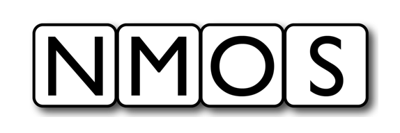

# AMWA BCP-NMOS-NDI: NMOS With NDI: Overview
{:.no_toc}

* A markdown unordered list which will be replaced with the ToC, excluding the "Contents header" from above
{:toc}

_(c) AMWA 2023, CC Attribution-NoDerivatives 4.0 International (CC BY-ND 4.0)_

## Introduction

> Provide an overview of the Specification.

Familiarity with the [JT-NM Reference Architecture](https://jt-nm.org/reference-architecture/) is assumed.

See also the [NMOS Technical Overview](https://specs.amwa.tv/nmos/main/docs/Technical_Overview.html).

## Use of Normative Language

The key words "MUST", "MUST NOT", "REQUIRED", "SHALL", "SHALL NOT", "SHOULD", "SHOULD NOT", "RECOMMENDED", "MAY",
and "OPTIONAL" in this document are to be interpreted as described in [RFC 2119][RFC-2119].

## Definitions

The NMOS terms 'Node', ... are used as defined in the [NMOS Glossary](https://specs.amwa.tv/nmos/main/docs/Glossary.html).

> List as appropriate

This specification also defines the following terms.

### Example Term

Example definition

[RFC-2119]: https://tools.ietf.org/html/rfc2119 "Key words for use in RFCs"
