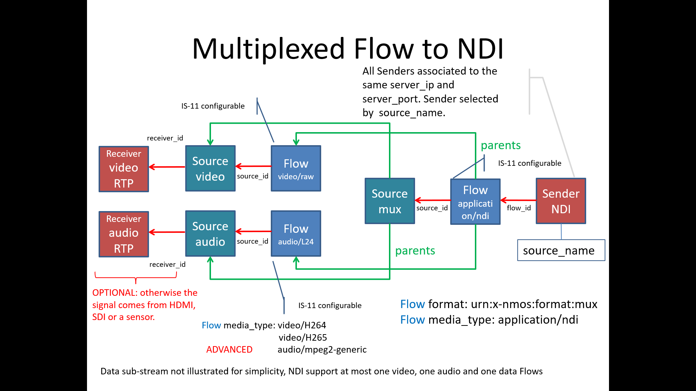
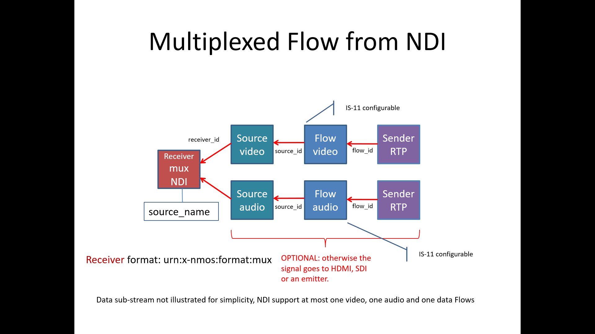

# AMWA BCP-007-01: NMOS With NDI
{:.no_toc}

- A markdown unordered list which will be replaced with the ToC, excluding the "Contents header" from above
{:toc}

_(c) AMWA 2023, CC Attribution-NoDerivatives 4.0 International (CC BY-ND 4.0)_

## Introduction

NDI (Network Display Interface) is an IP transport and control technology created by Newtek, a division of Vizrt Group. It includes definitions of encoding, transport and provides a full SDK to implement IP media transport. This document outlines how NDI devices can be managed through NMOS IS-04 and IS-05.

Familiarity with the [JT-NM Reference Architecture](https://jt-nm.org/reference-architecture/) and the [NDI® SDK](https://ndi.video/sdk/) are assumed.

See also the [NMOS Technical Overview](https://specs.amwa.tv/nmos/main/docs/Technical_Overview.html).

## Use of Normative Language

The key words "MUST", "MUST NOT", "REQUIRED", "SHALL", "SHALL NOT", "SHOULD", "SHOULD NOT", "RECOMMENDED", "MAY",
and "OPTIONAL" in this document are to be interpreted as described in [RFC-2119](https://datatracker.ietf.org/doc/html/rfc2119).

> Make sure normative terms are UPPERCASE.   Check with Peter on MUST vs SHALL

## Dependencies


This document was written based upon [NDI® Advanced SDK Version 5.5](https://ndi.video/sdk/), however devices which implement other versions of the SDK MAY also be supported.

This document depends upon the following reference documents:
- [NMOS IS-04 - Discovery and Registration](https://specs.amwa.tv/is-04/) - V1.3.2
- [NMOS IS-05 - Device Connection Management](https://specs.amwa.tv/is-05/) - V1.1.2
- [NMOS BCP-004-01 - Receiver Capabilites](https://specs.amwa.tv/bcp-004-01/) - V1.0.0
- [NMOS BCP-006-02 - NMOS with H.264](https://specs.amwa.tv/bcp-006-01/) - V1.0.0
- [NMOS BCP-006-03 - NMOS with H.265](https://specs.amwa.tv/bcp-006-01/) - V1.0.0


## Definitions

The NMOS terms ‘Controller’, ‘Node’, ‘Source’, ‘Flow’, ‘Sender’, ‘Receiver’ are used as defined in the [NMOS Glossary](https://specs.amwa.tv/nmos/main/docs/Glossary.html).

This specification also defines the following terms:

### NDI SDK

The NDI Software Development Kit (SDK) is offered in two variants. The base version SHALL be referred to as **NDI Standard SDK**, The Advanced SDK SHALL be referred to as **NDI Advanced SDK**. References to **NDI SDK** SHALL be interpreted to apply to both the **NDI Standard SDK** and **NDI Advanced SDK**.

> Describe what we mean by "Native" in the context of IS-05 Non-NMOS devices
> Define Non-NMOS Device / Sender / Receiver -> Native Device/Sender/Receiver which doesnt implement NMOS.

### Native NDI Device

A “device” as defined in the NDI SDK. This SHALL NOT be inferred to be a “Device” as defined in the NMOS Glossary. Note that the same physical or logical apparatus MAY simultaneously act as an NMOS Device and a Native NDI Device.

### Non-NMOS NDI Device
A Native NDI Device which does not support the NMOS specifications.

### NDI Stream

A "stream" as defined in the NDI SDK. An NDI Stream is a multiplexed structure that may include one or more video, audio and metadata flows. 

### Native NDI Sender

A "sender" of an NDI stream as defined in the NDI SDK. This SHALL NOT be inferred to be a “sender” as defined in the NMOS Glossary. Note that the same physical or logical apparatus MAY simultaneously act as an NMOS Sender and a Native NDI Sender.

### Native NDI Receiver

A "receiver" of an NDI stream as defined in the NDI SDK. This SHALL NOT be inferred to be a “Receiver” as defined in the NMOS Glossary. Note that the same physical or logical apparatus MAY simultaneously act as an NMOS Receiver and a Native NDI Receiver.

### NDI Device
A Native NDI NDI Device which implements IS-04 and allows registration in a Registry

### NDI Sender

An NMOS Sender which implements the NDI transport.

### NDI Receiver

An NMOS Receiver which implements the NDI transport.

### NDI Full Bandwidth

An NDI stream which utilizes proprietary codecs for audio and video. NDI Full Bandwidth is supported by both the NDI Standard SDK and NDI Advanced SDK.

### NDI HX, NDI HX2, NDI HX3

NDI High Efficiency profiles, named **NDI HX**, **NDI HX2**, and **NDI HX3** utilize H.264/AVC, H.265/HEVC AAC and Opus codecs. These are supported by the NDI Advanced SDK only.

**NDI HX** utilizes Long-GOP H.264 video encoding at maximum Full HD resolution, and AAC audio encoding. NDI HX is sometimes stylized **NDI|HX** in some documentation.

**NDI HX2** utilizes H.264 or H.265 Long-GOP video coding up to UHD resolution, and AAC or Opus audio encoding. NDI HX2 is sometimes stylized **NDI|HX2** in some documentation.

**NDI HX3** utilizes H.264 or H.265 Short-GOP coding up to UHD resolution to minimize latency with AAC or Opus audio encoding. NDI HX3 is sometimes stylized **NDI|HX3** in some documentation.

### NDI

This document SHALL use the term "NDI" when referring to all NDI variants, and specify "NDI Full Bandwidth", "NDI HX", "NDI HX2", or "NDI HX3" where the text applies to specific NDI variants.

## Native NDI Model

NDI Streams utilize a variety of codecs to compress media. In many cases, the NDI SDK negotiates between Native NDI Devices to select the transport and encoding parameters used for an NDI Stream. A Native NDI Receiver does not learn about the encoding and transport parameters of an NDI Stream until a connection is established.


### NDI Full Bandwidth

The NDI SDK, by default, automatically selects and negotiates encoding parameters between Native NDI Devices. Media content enters the Native NDI Sender as raw, uncompressed media and raw, uncompressed media emerges from Native NDI Receivers.

Since the NDI SDK controls the encoding and interfaces, NMOS flows SHALL be represented as:

- `media_type` of `video/raw` for video flows
- `media_type` for audio flows SHALL match the encoding of the audio source

### NDI HX, NDI HX2, NDI HX3

The NDI Advanced SDK supports compressed NDI Streams utilizing H.264, H.265, and AAC codecs. Media content enters the Native NDI Sender as compressed media and compressed media emerges from Native NDI Receivers.

For NDI HX, HX2 and HX3 implementation, NMOS Flows SHALL be represented as:

- `media_type` of `video/H264`, `video/H265` for video flows
- `media_type` of `audio/mpeg4-generic` for audio flows utilizing the AAC codec.
- `media_type` of `audio/opus` for audio flows utilizing the Opus codec.

### NDI Metadata

Metadata connections MAY be implicitly established by the NDI SDK when video connections are established. In some cases, bi-directional metadata connections MAY be established by the NDI SDK between the Native NDI Sender and Native NDI Receiver. NDI Metadata SHALL NOT be represeneted explicitly in NMOS.

## NMOS-NDI Model

Native NDI Devices, Native NDI Receivers and Native NDI Senders MAY be represeneted by NMOS Devices/Nodes, Receivers and Senders repectively.

A controller which supports NDI connection management via IS-05 SHOULD support connection of NDI Receivers to NDI Senders. This controller MAY also support connection of NDI Receivers to Native NDI senders, however it SHALL determine its list of available Native NDI Senders through its own means. 

NDI Devices SHOULD NOT preclude connections established with Native NDI devices via the NDI SDK.

If an NDI Stream is connected to an NDI Receiver outside of IS-05, the Receiver MUST update its `active` status to the Non-NMOS device.

Native NDI Senders do not appear in an NMOS Registry.  They MAY be discovered through the NDI discovery mechanism through the NDI SDK. 

### Use Case Scenarios


The following use cases refer to the NMOS-NDI model diagram above.

#### Use Case 1: Native NDI Sender to NDI Receiver - IS-05 Connection


- Controller is informed of sender (device W) by its own means; this could be via NDI discovery.
- Controller is informed of receiver (device A) through IS-04 
- Controller initiates connection to receiver (device A) from sender (device W) via IS-05
- NDI Receiver (device A) reports its status as outlined in IS-05.

#### Use Case 2: Native NDI Sender to NDI Receiver - Non-NMOS Connection


- NDI Receiver (device B) is informed of Native NDI Sender (device X) by its own means; this could be via NDI discovery.
- NDI Receiver (device B) initiates connection to Native NDI Sender (device X) directly via NDI SDK.
- NDI Receiver updates its IS-05 `active` state, setting the `sender_id` to `null`
- The controller does not initiate the connection, but SHOULD be informed of the receiver (device B) status via IS-05

#### Use Case 3: NDI Sender to Native NDI Receiver - Non-NMOS Connection


- Native NDI Receiver (device X) is informed of NDI Sender (device B) by its own means; this could be via NDI discovery.
- Native NDI Receiver (device X) initiates connection to NDI Sender (device B) directly via NDI SDK.
- The controller does not initiate the connection.

#### Use Case 4: NDI Sender to NDI Receiver - IS-05 Connection


- Controller is informed of sender (device C) through IS-04.
- Controller is informed of receiver (device D) through IS-04. 
- Controller initiates connection to receiver (device D) from sender (device C) via IS-05
- NDI Sender (device C) and NDI Receiver (device D)  report their status as outlined in IS-05.

#### Use Case 5: Native NDI Sender to Native NDI Receiver - Non-NMOS Connection


- This scenario exists outside the realm of NMOS. The controller may not be aware of these devices, and does not initiate any connection between them.
- Native NDI Receiver (device Z) and Native NDI Sender (device Y) discover  through their own means. this could be via NDI discovery.
- Connection from Native NDI Sender (device Y) to Native NDI Receiver (device Z) is performed by the NDI SDK.

#### Use Case 6: NDI Sender to NDI Receiver - Non-NMOS Connection


- In this scenario, both sender (device E) and receiver (device F) are NMOS devices, but connection is established outside of IS-05. 
- NDI Receiver (device E) and NDI Sender (device F) discover  through their own means. this could be via NDI discovery.
- Connection from NDI Sender (device E) to NDI Receiver (device F) is performed by the NDI SDK.
- NDI Receiver SHALL update its IS-05 `active` state, setting the `sender_id` to `null`


### Multiplexed Flow Model

Senders and Receivers of NDI Streams SHALL be always represented as a mux, as NDI connections MAY contain multiple essences including video, audio and metadata.

The current NDI SDK limits to a maximum of one each video, audio and metadata, but this specification supports future SDK versions which support multiple audio, video or metadata flows.

These multiplexed flows MUST be modeled as `mux` format.

Metadata flows are not explicitly modeled in NMOS and SHALL be considered implicit with an audio or video flow.

The NDI muxed flow SHALL have parents of video or audio flows.





> Perhaps we SHOULD include json examples of what MUX flow / source / receiver constructs look like


---

--- 

---

> Review ended here. 2023-Aug-09

---

--- 

---

## NDI IS-04 Sources, Flows and Senders

### Flows

**MUX flows**

NDI are always mux flows. Will need to make sure we have a way to specify capabilities on mux sender/receiver
The NDI muxed flow SHALL have parents of video or audio flows.

**Video flows**

NMOS Senders SHOULD map the employed `NDIlib_FourCC_video_type` to the `bit-depth`, `component` and `sub-sampling` properties.
> NDI supports video+alpha video flows. These SHALL be modeled as a single video flow, including a channel labelled "A" in the `components` parameters.

**Audio flows**

Audio flow `media_type` SHALL be defined by the encoding of the source audio and utilize one of the known audio media types. Note that the NDI SDK MAY utilize different audio encoding, but this is negotiated by the SDK between the sender and receiver, and is not declared in the NMOS definition of the flow.

**Metadata flows**

Metadata is abstracted and does not appear as a discrete flow behind the mux.

### Sources

> Nothing special to state here. Probably delete this section.


### Senders

NDI Senders do not utilize SDP to describe the flow; therefore senders SHALL NOT specify the  `manifest_href` parameter.

For NDI, the transport SHALL be specified:

        transport: `urn:x-nmos:transport:ndi`

Additional parameters and properties that MAY be specified by a device via the NDI SDK are not be included in the NMOS NDI model. Those paramaters are considered device-specific controls.

### Metadata

Metadata flow MAY be implicitly connected when video connection is made.
Metadata flow MAY be bidirectional, i.e. one flow in each direction (e.g. PTZ camera control). These flows are not explicitly connected via controller.

## NDI IS-04 Receivers

### Receivers
>
> Note anything unique here

#### Receiver Capabilities

For the muxed flow, the mux receiver must specify:

```json
"caps" : {
    "media_types" : [
       "application/ndi"
    ]
}
```

> Additional capabilities for sub-flows MAY need to be expressed. This relies on additional work that has yet to be done.
> Codecs for audio and video will need to be expressed

## NDI IS-05 Senders and Receivers

### Transport Type

NDI Flows SHALL utilize a new `transport` in IS-05:

 ```
 urn:x-nmos:transport:ndi
 ```

This `transport` signifies a muxed NDI flow delivered by the NDI SDK.

### Sender transport_file

Not used.

### Sender Transport Parameters

```json
"transport_params": [{
        "source_ip": "10.10.10.10",
        "source_port": 5960,
        "source_name": "ndi-sender-unique-name",
        "group_name": "camera1"

}]
```

**source_ip**
IP address hosting the NDI server (IP address of interface bound to the server). If the parameter is set to auto the Sender SHOULD establish for itself which interface it SHOULD use, based on its own internal configuration. A null value indicates that the Sender has not yet been configured.

**source_port**
Port for the NDI server. If the parameter is set to auto the Sender SHOULD establish for itself which port it SHOULD use, based on its own internal configuration.

**source_name**
The name of the stream as declared by the NDI Sender. The stream MAY contains multiple elements like video, audio, data, etc. => at most one of each

**group_name**
Indicate the NDI group of the source. Null indicates the default group.

Although the NDI Advanced SDK does provide provisions for NDI Native Devices to specify additional transport parameters, they are part of the NMOS NDI model. These parameters and properties SHALL be considered device-specific.

### Receiver Parameters

```json
 "transport_params": [{
        "interface_ip": "10.10.10.20",
        "server_host": "10.10.10.10",
        "server_port": 5960,
        "source_name": "ndi-sender-unique-name",
        "group_name": "camera1"
    }]

```

**interface_ip**
IP address of the network interface the receiver SHOULD use.

**server_host**
Hostname or IP hosting the NDI server. If the parameter is set to “auto” the Receiver SHOULD establish for itself which server it SHOULD use, based on a discovery mechanism or its own internal configuration. A null value indicates that the Receiver has not yet been configured. MAY be IP address or hostname URL.

**server_port**
Port for NDI server. If the parameter is set to “auto” the Receiver SHOULD establish for itself which port it SHOULD use, based on a discovery mechanism or its own internal configuration.

**source_name**
The name of the stream as declared by the NDI sender. The stream MAY contain multiple elements like video, audio, data, etc. => at most one of each

**group_name**
Indicate the NDI group of the source, null indicates the default group

## Controllers

### Query of Registered Nodes, Senders and Receivers

A controller MAY query registered Nodes, NDI Senders and NDI Receivers from the registry. An NDI Receiver MUST be registered in the registry in order to allow a controller to manage connections to it through IS-05.


An NDI source MAY be registered in the registry if the NDI device implements the required IS-04 services. However, a controller MAY direct a receiver to connect to a Native NDI Sender if the controller has knowledge of that sender (either through NDI discovery or other means).

### Discovery of Native NDI Senders

A controller MAY discover Native NDI Senders via the NDI SDK. This could allow a controller to establish connections between an NDI Receiver and an NDI Native Sender.

Native NDI Devices which do not implement NMOS IS-04 SHALL NOT be registered in an NMOS Registry.
