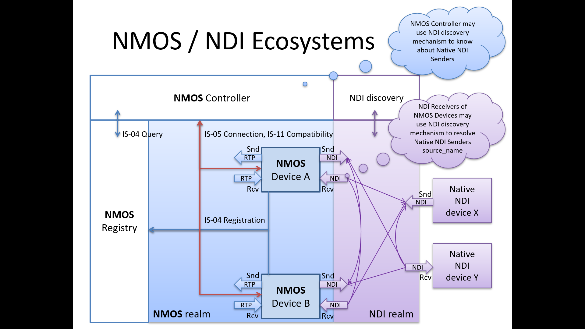

# AMWA BCP-NMOS-NDI: NMOS With NDI
{:.no_toc}

- A markdown unordered list which will be replaced with the ToC, excluding the "Contents header" from above
{:toc}

_(c) AMWA 2023, CC Attribution-NoDerivatives 4.0 International (CC BY-ND 4.0)_


## Introduction
NDI (Network Display Interface) is an IP transport and control technology created by Newtek, a division of VizRT. It includes definitions of encoding, transport and provides a full SDK to implement IP media transport. This document outlines how NDI devices can be managed through NMOS IS-04 and IS-05.

Familiarity with the [JT-NM Reference Architecture](https://jt-nm.org/reference-architecture/) and the [NDI® SDK](https://ndi.video/sdk/) are assumed.

See also the [NMOS Technical Overview](https://specs.amwa.tv/nmos/main/docs/Technical_Overview.html).

## Use of Normative Language

The key words "MUST", "MUST NOT", "REQUIRED", "SHALL", "SHALL NOT", "SHOULD", "SHOULD NOT", "RECOMMENDED", "MAY",
and "OPTIONAL" in this document are to be interpreted as described in [RFC-2119](https://datatracker.ietf.org/doc/html/rfc2119).

## Dependencies

This document depends upon the following reference documents:

- [NDI® Advanced SDK Version 5.5](https://ndi.video/sdk/), 2023-02-01, Newtek Inc.
- [NMOS IS-04](https://specs.amwa.tv/is-04/) V1.3.2
- [NMOS IS-05](https://specs.amwa.tv/is-05/) V1.1.2
- [NMOS BCP-004-01](https://specs.amwa.tv/bcp-004-01/) V1.0.0

## Definitions

The NMOS terms ‘Controller’, ‘Node’, ‘Source’, ‘Flow’, ‘Sender’, ‘Receiver’ are used as defined in the [NMOS Glossary](https://specs.amwa.tv/nmos/main/docs/Glossary.html).

This specification also defines the following terms:

### NDI SDK

The NDI Software Development Kit (SDK) is offered in two variants. The base version shall be referred to as **NDI Standard SDK**, The Advanced SDK shall be referred to as **NDI Advanced SDK**. References to **NDI SDK** shall be interpreted to apply to both the **NDI Standard SDK** and **NDI Advanced SDK**. 

### Native NDI Device

A “device” as defined in the NDI SDK. This shall not be inferred to be a “device” as defined in the NMOS Glossary. Note that the same physical or logical apparatus may simultaneously act as an NMOS device and a Native NDI Device.

### Native NDI Sender

A sender of an NDI stream as defined in the NDI SDK. This shall not be inferred to be a “sender” as defined in the NMOS Glossary. Note that the same physical or logical apparatus may simultaneously instantiate an NMOS sender and Native NDI Sender.

### Native NDI Receiver

A receiver of an NDI stream as defined in the NDI SDK. This shall not be inferred to be a “receiver” as defined in the NMOS Glossary. Note that the same physical or logical apparatus may simultaneously instantiate an NMOS receiver and Native NDI Receiver.

### NDI Full Bandwidth

A profile within NDI which utilizes proprietary codecs for audio and video with typical bandwidth of 125-140Mb/s per HD video flow. NDI Full Bandwidth is supported by both the NDI Standard SDK and NDI Advanced SDK.

### NDI HX, NDI HX2, NDI HX3

NDI High Efficiency profiles, named **NDI HX**, **NDI HX2**, and **NDI HX3** utilize H.264, HEVC and AAC codecs and are supported by the NDI Advanced SDK.

**NDI HX** utilizes long-gop H.264 video encoding and AAC audio encoding with typical bandwidth of 8-20Mb/s per HD video flow. NDI HX is sometimes stylized **NDI|HX** in some documentation.

**NDI HX2** utilizes H.264 or HEVC long-gop video coding and AAC audio encoding utilizing approximately half the bandwidth of NDI HX when HEVC encoding is utilized. NDI HX2 is sometimes stylized **NDI|HX2** in some documentation.

**NDI HX3** utilizes H.264 or HEVC short-gop coding to minimize latency with AAC audio coding, utilizing approximately 80Mb/s per HD video flow. NDI HX3 is sometimes stylized **NDI|HX3** in some documentation.

### NDI 
This document shall use the term "NDI" when referring to all NDI variants, and specify "NDI full bandwidth", "NDI HX", "NDI HX2", or "NDI HX3" where the text applies to specific NDI variants.

## Native NDI Model

NDI media flows utilize a variety of codecs to compress media flows. In many cases, the NDI SDK negotiates between nodes to select the codec, transport parameters, and encoding parameters used for a media flow. A Native NDI Receiver does not learn about the encoding and transport parameters of an NDI flow until a connection is established. 

### NDI Full Bandwidth
The NDI SDK, by default, automatically selects and negotiates encoding parameters between nodes. Media content enters the Native NDI Sender as raw, uncompressed media and raw, uncompressed media emerges from Native NDI Receivers. 

Since the NDI SDK controls the encoding and interfaces the host application using raw media, NMOS models NDI flows as:
- `media_type` of `video/raw` for video flows
- `media_type` for audio flows shall match the encoding of the audio source

### NDI HX, NDI HX2, NDI HX3
The NDI Advanced SDK supports compressed flows utilizing h.264, h.265, and aac codecs. In these implementations, the host application presents compressed frames of media to the Native NDI Sender and a Native NDI receiver presents compressed media frames to the host application. 

For NDI HX, HX2 and HX3 implementation, NMOS models NDI flows as:
- `media_type` of `video/H264`, `video/H265` for video flows
- `media_type` of `audio/mpeg4-generic` for audio flows 

### NDI Metadata
Metadata connections may be implicitly established by the NDI SDK when video connections are established. In some cases, bi-directional metadata connections may be established by the NDI SDK between the Native NDI Sender and Native NDI Receiver. NDI Metadata will not be represeneted explicitly through NMOS. 


## NMOS-NDI Model



NDI Native Devices, NDI Native Receivers and NDI Native Senders may be represeneted by NMOS Device/Node, Receivers and Senders repectively. 

A controller which supports NDI connection management via IS-05 shall support connection of NMOS-enabled NDI receivers to NMOS-enabled NDI senders. This controller may also support connection NMOS-enabled NDI receivers to Native NDI senders, however it shall determine its list of available Native NDI Senders through its own means. These Native NDI Senders shall not be included in an NMOS registry.

Senders and Receivers of NDI flows shall be always represented as a mux, as NDI connections may contain multiple essences including video, audio and metadata. 

### Multiplexed Flow Model
NDI flows may contain one or more elementary flows:
- video (may be video only or video+alpha)
- audio
- metadata

The current NDI SDK limits to a maximum of one each video, audio and metadata, but the implementation should be extensible. If future versions of the NDI SDK supports it, mux flows should support multiple of each format.

These multiplexed flows shall be modeled as `mux` format.

Metadata flows are not explicitly modeled in NMOS and shall be considered implicit with an audio or video flow.

The NDI muxed flow shall have parents of video or audio flows. 


> Perhaps we should include json examples of what MUX flow / source / receiver constructs look like

## NDI IS-04 Sources, Flows and Senders

### Flows

**MUX flows**

NDI are always mux flows. Will need to make sure we have a way to specify capabilities on mux sender/receiver 
The NDI muxed flow shall have parents of video or audio flows. 

**Video flows** 

NMOS Senders should map the employed `NDIlib_FourCC_video_type` to the `bit-depth`, `component` and `sub-sampling` properties. 
> NDI supports video+alpha video flows. These shall be modeled as a single video flow, including a channel labelled "A" in the `components` parameters.

**Audio flows**

Audio flow `media_type` shall be defined by the encoding of the source audio and utilize one of the known audio media types. Note that the NDI SDK may utilize different audio encoding, but this is negotiated by the SDK between the sender and receiver, and is not declared in the NMOS definition of the flow.

**Metadata flows**

Metadata is abstracted and does not appear as a discrete flow behind the mux.


### Sources
> Nothing special to state here. Probably delete this section.
>]


### Senders

NDI Senders do not utilize SDP to describe the flow; therefore senders shall not specify the  `manifest_href` parameter.

For NDI, the transport shall be specified:

        transport: `urn:x-nmos:transport:ndi`

Additional parameters and properties that may be specified by a device via the NDI SDK are not be included in the NMOS NDI model. Those paramaters are considered device-specific controls. 

### Metadata

Metadata flow may be implicitly connected when video connection is made.
Metadata flow may be bidirectional, i.e. one flow in each direction (e.g. PTZ camera control). These flows are not explicitly connected via controller. 


## NDI IS-04 Receivers

### Receivers
> Note anything unique here


#### Receiver Capabilities

For the muxed flow, the mux receiver must specify:

```json
"caps" : {
    "media_types" : [
       "application/ndi"
    ]
}
```

> Additional capabilities for sub-flows may need to be expressed. This relies on additional work that has yet to be done.


## NDI IS-05 Senders and Receivers


### Transport Type
NDI Flows shall utilize a new `transport_type` in IS-05:

 ```
 urn:x-nmos:transport:ndi
 ```

This transport_type signifies a muxed NDI flow delivered by the NDI SDK. 


### Sender transport_file

Not used.

### Sender Transport Parameters

```json
"transport_params": [{
        "source_ip": "10.10.10.10",
        "source_port": 5960,
        "source_name": "ndi-sender-unique-name",
        "group_name": "camera1"

}]
```


**source_ip**
IP address hosting the NDI server (IP address of interface bound to the server). If the parameter is set to auto the Sender should establish for itself which interface it should use, based on its own internal configuration. A null value indicates that the Sender has not yet been configured.

**source_port**
Port for the NDI server. If the parameter is set to auto the Sender should establish for itself which port it should use, based on its own internal configuration.

**source_name**
The name of the stream as declared by the NDI Sender. The stream may contains multiple elements like video, audio, data, etc. => at most one of each

**group_name**
Indicate the NDI group of the source. Null indicates the default group.

Although the NDI Advanced SDK does provide provisions for NDI Native Devices to specify additional transport parameters, they are part of the NMOS NDI model. These parameters and properties shall be considered device-specific.


### Receiver Parameters

```json
 "transport_params": [{
        "interface_ip": "10.10.10.20",
        "server_host": "10.10.10.10",
        "server_port": 5960,
        "source_name": "ndi-sender-unique-name",
        "group_name": "camera1"
    }]

```

**interface_ip**
IP address of the network interface the receiver should use.

**server_host**
Hostname or IP hosting the NDI server. If the parameter is set to “auto” the Receiver should establish for itself which server it should use, based on a discovery mechanism or its own internal configuration. A null value indicates that the Receiver has not yet been configured. may be IP address or hostname URL.

**server_port**
Port for NDI server. If the parameter is set to “auto” the Receiver should establish for itself which port it should use, based on a discovery mechanism or its own internal configuration.

**source_name**
The name of the stream as declared by the NDI sender. The stream may contain multiple elements like video, audio, data, etc. => at most one of each

**group_name**
Indicate the NDI group of the source, null indicates the default group


## Controllers
### Query of Registered Nodes, Senders and Receivers
A controller may query registered nodes, senders and receivers from the registry. An NDI receiver must be registered in the registry in order to allow a controller to manage connections to it. 

An NDI source may be registered in the registry if the NDI device implements the required IS-04 services. However, a controller may direct a receiver to connect to a Native NDI Sender if the controller has knowledge of that sender (either through NDI discovery or other means).

### Discovery of Native NDI Senders
A controller may discover Native NDI Senders via the NDI SDK. This could allow a controller to establish connections between a Receiver device and an NDI Native Sender. 

Native NDI Devices which do not implement NMOS IS-04 shall not be registered in an NMOS Registry.


